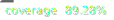

[](https://github.com/ShadowNineX/headbreaker/actions)
[](https://sonarcloud.io/summary/new_code?id=ShadowNineX_headbreaker)


# 🧩 🤯 Headbreaker

> Jigsaw Puzzles Framework written in TypeScript — v4.0

> [!WARNING]
> This is a new version of headbreaker (`headbreaker-ts`) and may contain bugs. If you encounter any issues, please [open a bug report](https://github.com/ShadowNineX/headbreaker/issues/new?template=bug_report.md) — it's greatly appreciated!

> [!NOTE]
> Documentation is still being updated for v4. Some pages may reflect older behavior — if something doesn't match, the source code and tests are the best reference.

`headbreaker` - a Spanish pun for _rompecabezas_ - is a TypeScript framework for building all kinds of jigsaw puzzles.

## ☑️ Features

 * Written in TypeScript with full type declarations
 * Headless domain-model support
 * Highly tested with Vitest
 * Customizable data-model
 * Zero-dependencies — Konva.js is an optional rendering backend that can be replaced with custom code
 * ES Module and CommonJS output formats

## 📦 Installing

```bash
bun add headbreaker-ts

# optional: add konva if you want to use it as the rendering backend
bun add konva
```

## ⏳ TL;DR sample

If you just want to see a — very basic — 2x2 puzzle in your web-browser, then create an HTML file with the following contents 😁:

```html
<script src="https://ShadowNineX.github.io/headbreaker/js/headbreaker.js"></script>
<body>
  <div id="puzzle"></div>
  <script>
    const autogen = new headbreaker.Canvas('puzzle', {
      width: 800, height: 650,
      pieceSize: 100, proximity: 20,
      borderFill: 10, strokeWidth: 2, lineSoftness: 0.18,
    });
    autogen.autogenerate({
      horizontalPiecesCount: 2,
      verticalPiecesCount: 2,
      metadata: [
        {color: '#B83361'},
        {color: '#B87D32'},
        {color: '#A4C234'},
        {color: '#37AB8C'}
      ]
    });
    autogen.draw();
  </script>
</body>
```

And voilà! 🎊


However, there is a lot more that `headbreaker` can do for you. These are some of its coolest features:

 * Customizable pieces outlines
 * Irregular pieces
 * Image support
 * Sound support
 * Event system
 * Automatic validation
 * Data import and export

## 🏁 Quick start

`headbreaker` is a library which solves two different — but related — problems:

  * It implements a jigsaw-like data-structure, which can be used in tasks like modelling, traversing, importing, exporting, and — of course — rendering. This data-structure has no dependencies and can be used both in browsers and headless environments.
  * It implements a simple and generic rendering system for the Web. `headbreaker` ships a fully functional [Konva.js](https://konvajs.org/)-based implementation via `painters.Konva`, but you may develop and use your own implementation by implementing the `Painter` interface.

`headbreaker` is designed to be installed as an npm package, but you can also import it directly in static pages from [`https://ShadowNineX.github.io/headbreaker/js/headbreaker.js`](https://ShadowNineX.github.io/headbreaker/js/headbreaker.js).

### HTML Puzzle

```html
<!-- just add a div with an id... -->
<div id="my-canvas">
</div>

<script>
  // ...and a script with the following code:
  const dali = new Image();
  dali.src = 'static/dali.jpg';
  dali.onload = () => {
    const canvas = new headbreaker.Canvas('my-canvas', {
      width: 800, height: 800, image: dali
    });
    canvas.autogenerate();
    canvas.shuffle(0.7);
    canvas.draw();
  };
</script>
```

`Canvas` is a visual representation of a `Puzzle` and mirrors many of its common methods. If you need to access the underlying `Puzzle` object directly, use the `puzzle` accessor:

```typescript
// create and configure the canvas
const canvas = new headbreaker.Canvas(...);
// ...

// access and interact with the puzzle object
const puzzle = canvas.puzzle;
```

### Headless Puzzle

`headbreaker` provides a `Puzzle` class that lets you fully manipulate the model and its individual `Piece`s without any visual representation. It can be used in headless environments such as a Node.js server:

```typescript
import { Puzzle, Slot, Tab, vector } from 'headbreaker-ts'

// Create a puzzle
const puzzle = new Puzzle()
puzzle
  .newPiece({ right: Tab })
  .locateAt(0, 0)
puzzle
  .newPiece({ left: Slot, right: Tab })
  .locateAt(3, 0)
puzzle
  .newPiece({ left: Slot, right: Tab, down: Slot })
  .locateAt(6, 0)
puzzle
  .newPiece({ up: Tab })
  .locateAt(6, 3)

// Connect puzzle's nearby pieces
puzzle.autoconnect()

// Translate puzzle
puzzle.translate(10, 10)

// Shuffle pieces
puzzle.shuffle(100, 100)

// Relocate pieces to fit into a bounding box
// while preserving their relative positions, if possible
puzzle.reframe(vector(0, 0), vector(20, 20))

// Directly manipulate pieces
const [a, b, c, d] = puzzle.pieces

// Drag a piece 10 steps right and 5 steps down
a.drag(10, 5)

// Connect two pieces (if possible)
a.tryConnectWith(b)

// Add custom metadata to pieces
a.metadata.flavour = 'chocolate'
a.metadata.sugar = true
b.metadata.flavour = 'chocolate'
b.metadata.sugar = false

c.metadata.flavour = 'vainilla'
c.metadata.sugar = false
d.metadata.flavour = 'vainilla'
d.metadata.sugar = true

// Require pieces to match a given condition in order to be connected
puzzle.attachConnectionRequirement((one, other) => one.metadata.flavour === other.metadata.flavour)

// Alternatively, set individual requirements for horizontal and vertical connections
puzzle.attachVerticalConnectionRequirement((one, other) => one.metadata.flavour === other.metadata.flavour)
puzzle.attachHorizontalConnectionRequirement((one, other) => one.metadata.sugar !== other.metadata.sugar)

// Remove all connection requirements
puzzle.clearConnectionRequirements()

// Export and import puzzle
const dump = puzzle.export()
const otherPuzzle = Puzzle.import(dump)
```

## React Puzzle

> Check also [https://github.com/ShadowNineX/headbreaker-react-sample](https://github.com/ShadowNineX/headbreaker-react-sample)

```tsx
import { Canvas, painters } from 'headbreaker-ts'
import { useEffect, useRef } from 'react'

function DemoPuzzle({ id }: { id: string }) {
  const puzzleRef = useRef<HTMLDivElement>(null)

  useEffect(() => {
    if (!puzzleRef.current) return
    const canvas = new Canvas(puzzleRef.current.id, {
      width: 800,
      height: 650,
      pieceSize: 100,
      proximity: 20,
      borderFill: 10,
      strokeWidth: 2,
      lineSoftness: 0.18,
      painter: new painters.Konva(),
    })

    canvas.autogenerate({
      horizontalPiecesCount: 2,
      verticalPiecesCount: 2,
      metadata: [
        { color: '#B83361' },
        { color: '#B87D32' },
        { color: '#A4C234' },
        { color: '#37AB8C' },
      ],
    })

    canvas.draw()
  }, [])

  return <div ref={puzzleRef} id={id}></div>
}

export default function Home() {
  return (
    <main>
      <h1>Headbreaker From React</h1>
      <DemoPuzzle id="puzzle" />
    </main>
  )
}
```

## Vue Puzzle

> Check also [https://github.com/ShadowNineX/headbreaker-vue-sample](https://github.com/ShadowNineX/headbreaker-vue-sample)

```vue
<template>
  <div id="app">
    <div>Headbreaker from Vue</div>
    <div id="puzzle"></div>
  </div>
</template>

<script setup lang="ts">
import { Canvas, painters } from 'headbreaker-ts';
import { onMounted } from 'vue';

onMounted(() => {
  const autogen = new Canvas('puzzle', {
    width: 800,
    height: 650,
    pieceSize: 100,
    proximity: 20,
    borderFill: 10,
    strokeWidth: 2,
    lineSoftness: 0.18,
    painter: new painters.Konva(),
  });

  autogen.autogenerate({
    horizontalPiecesCount: 2,
    verticalPiecesCount: 2,
    metadata: [
      { color: '#B83361' },
      { color: '#B87D32' },
      { color: '#A4C234' },
      { color: '#37AB8C' },
    ],
  });

  autogen.draw();
});
</script>
```

## 👀 Demo and API Docs

See [ShadowNineX.github.io/headbreaker](https://ShadowNineX.github.io/headbreaker/)

## ❓ Questions

Do you have any questions or doubts? Please feel free to check [the existing discussions](https://github.com/ShadowNineX/headbreaker/discussions) or open a new one 🙋.

## 🏗 Develop

```bash
# install project
$ bun install
# run tests
$ bun test
# type-check
$ bun run typecheck
# lint
$ bun run lint
# lint and auto-fix
$ bun run lint:fix
# build library (CJS + ESM + DTS)
$ bun run build
# run all checks and build
$ bun run all
# start docs site locally (Astro Starlight)
$ cd docs && bun install && bun run dev
```

## Contributors

* [@flbulgarelli](https://github.com/flbulgarelli)
* [@Almo7aya](https://github.com/Almo7aya)
* [@ShadowNineX](https://github.com/ShadowNineX)
